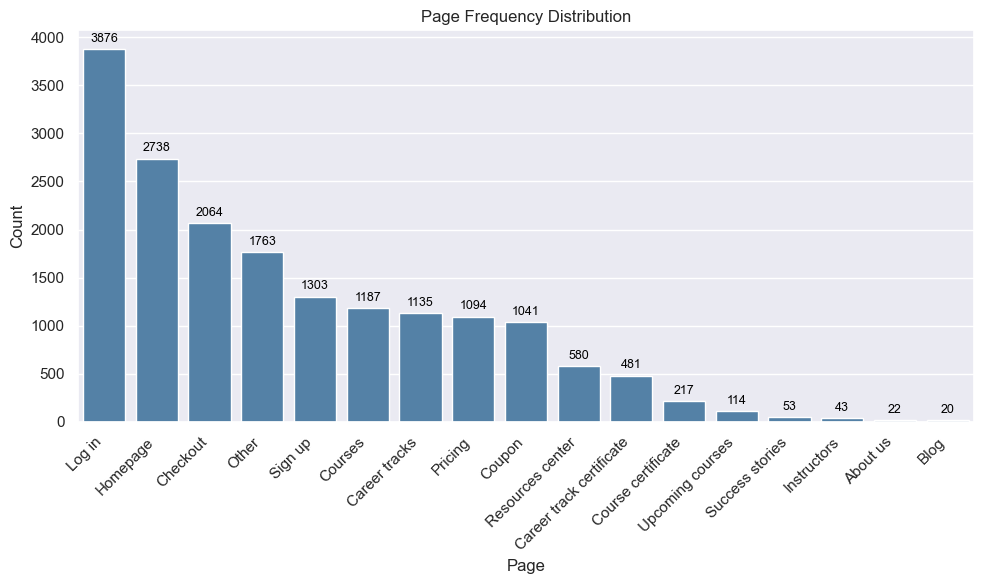
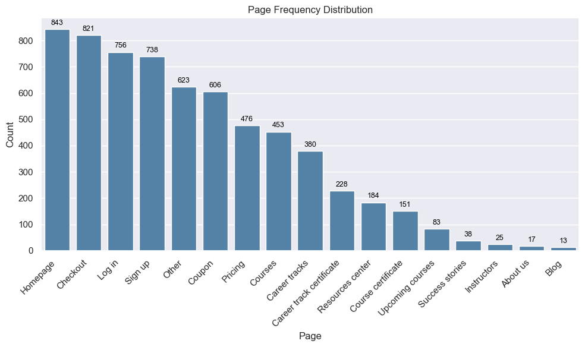
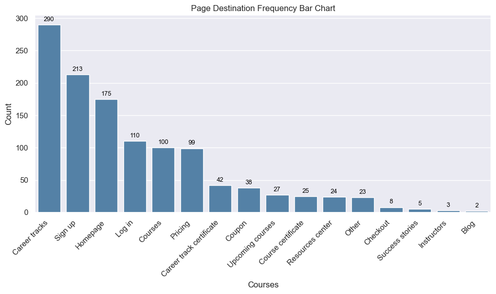
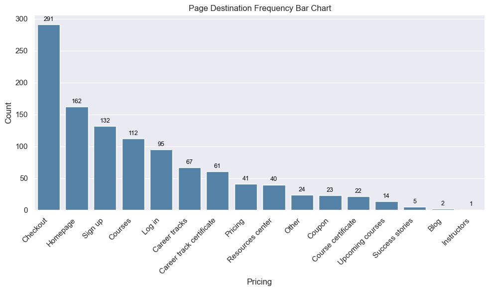
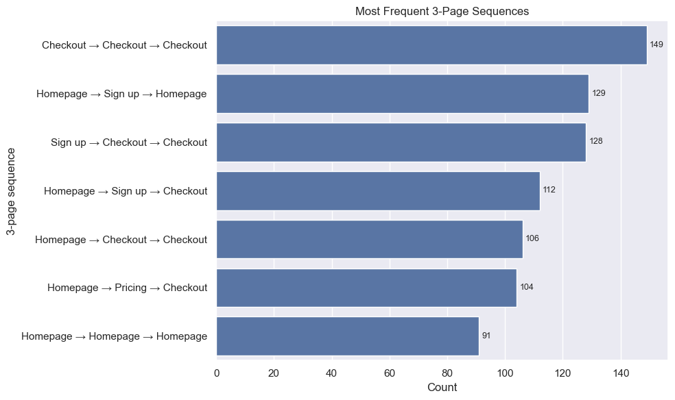

# 365DS Python Capstone Project: User Journey Analysis

This project analyzes user journeys across different website pages on the 365 Data Science website. 
It includes preprocessing of raw journey data, generation of metrics (page counts, destinations, sequences), and visualizations.
[text](https://365datascience.com/)


## 📂 Project Structure
```
PYTHON_CAPSTONE/
│
├── pictures/                     # Generated visualizations
│   ├── metrics.png
│   ├── pg_count_frequency_dist.png
│   └── pg_presence_freq_dist.png
│
├── processed_dfs/                # Intermediate processed datasets
│   ├── clean_collated_userjourney.csv
│   ├── collated_userjourney_by_userid.csv
│   └── user_journey_duplicates_removed.csv
│
├── results_dfs/                  # Final result datasets
│   ├── page_count.csv
│   ├── page_destination.csv
│   ├── page_presence.csv
│   └── page_sequence.csv
│
├── User_journey_raw.csv          # Raw input dataset
├── User_journey_analysis.ipynb   # Main analysis notebook
├── pyproject.toml                 # Project dependencies / environment
└── ReadME.md                     # Project documentation (this file)
```

---

## 📊 Data Pipeline

1. **Raw Data (`User_journey_raw.csv`)**
   - Contains the original user journey logs.

2. **Processing (`processed_dfs/`)**
   - `clean_collated_userjourney.csv`: Cleaned and merged dataset.
   - `collated_userjourney_by_userid.csv`: User journeys grouped by user.
   - `user_journey_duplicates_removed.csv`: Journeys with duplicates removed.

3. **Results (`results_dfs/`)**
   - `page_count.csv`: Frequency of each page visited.
   - `page_destination.csv`: Most common follow-up pages.
   - `page_presence.csv`: Presence/absence distribution of pages.
   - `page_sequence.csv`: Most frequent multi-page sequences.

4. **Visualizations (`pictures/`)**
   - Page frequency and presence distributions.
   - Other derived metrics.

---

## 🚀 Usage

1. Install dependencies
   ```bash
   pip install -r requirements.txt
   ```
   *(or use `pyproject.toml` with Poetry/other env managers)*

2. Run the Jupyter notebook:
   ```bash
   jupyter notebook User_journey_analysis.ipynb
   ```

3. Outputs:
   - Processed datasets in `processed_dfs/`
   - Results in `results_dfs/`
   - Visualizations in `pictures/`

---

## 📈 Metrics Defined

- **Page Count**: Total visits per page.
- **Page Presence**: Whether a page appears in a user’s journey.
- **Page Destination**: Most frequent next-page transitions.
- **Page Sequence**: Most common multi-step sequences (e.g., 3-page runs).

---

## 📈 Results
#### Page Count Frequency Distribution
```Page count``` : is the most fundamental metric; it counts how many times each page can be found in all user journeys. 
From this image, `Log in`, `Homepage` and `Checkout` pages are the top 3 visited pages on the website while `Blog`, `About us`, and `Instructors` are the least visited pages on the website by total count.


#### Page Presence Frequency Distribution
```Page presence``` : is similar to ‘page count’ but counts each page only once if it exists in a journey; it shows how many times each page is part of a journey.
By unique counts, there is clearly a stratified order to the pages frequency with 
 - General Page and Log in/Sign up pages taking the highest frequencies.
 - Pricing & coupons pages following after.
 - Courses & certificates taking the third strata
 - Information & communication pages been the least of them all. 


#### Page Destination Frequency Distribution
```Page destination``` : is a metric that shows the most frequent follow-ups after every page. It looks at every page and counts which pages follow next. If one is interested in what the users do after visiting page X, they can consult this metric.
For this metric, I focused on two pages, `Courses`, and `Pricing`.

**Courses**
The highest follow-up page with `Courses` page is `Career Tracks` page 
showing that students are not just only interested in taking the courses but 
also in interested in a career tracks courses.


**Pricing**
The highest follow-up page with `Pricing` page is `Checkout` page 
showing a possible high turnover of users to be paying customers.



#### Page Sequence Frequency Distribution
```Page sequences``` : look at what the most popular run of N pages is. I will consult this metric if I’m interested in the sequence of three (or any other number) pages that most often shows up. Count each sequence only once per journey.



#### Journey Length Values
**Raw Data**: `15.3pages`
   - This show the average length of pages an individual user in a session 
   visited.
**Collated Pages Data**: `119.3pages`
   - This shows the average pages length for all collated sessions of users. 
**Cleaned_collated Pages Data**: `91.4pages`
   - This shows the average pages length for all collated sessions of users.
   having removed redundant pages like `Log in` and `Others`.


## 📌 Next Steps
- Add support for longer sequence analysis (N > 3).
- Build a dashboard for interactive exploration.
- Integrate cohort analysis by subscription type and and individual analysis of users using user_id.

---

*(N:B This is a course project data: Data does not necessarrily represent real case scenario)*

## 👤 Author
- *Arowosegbe Victor Iyanuoluwa*
